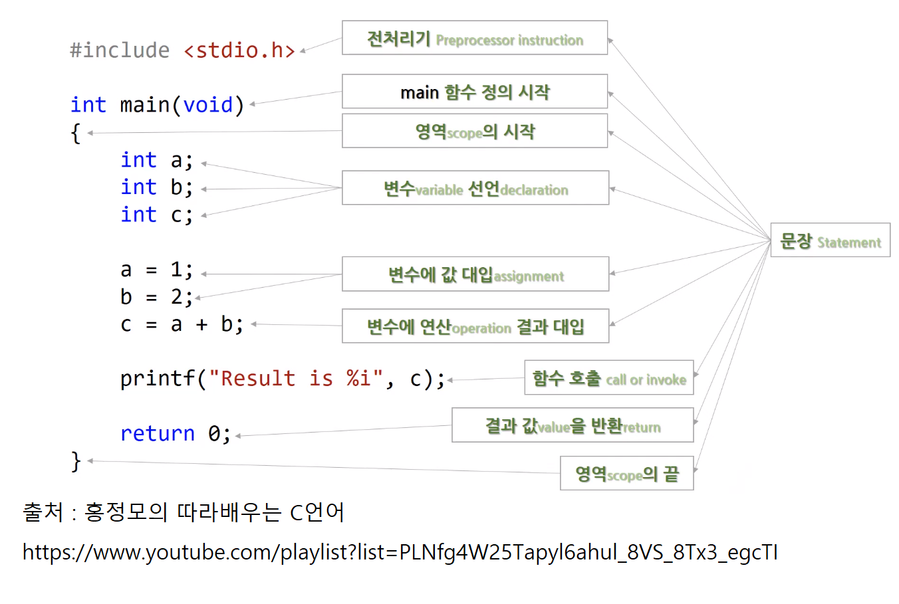

예시를 통해 언어적 특징에서 간단히 훑어보았다.

## 전처리기(preprocessor instruction)

- 다른 사람이 미리 만들어놓은 혹은 c 개발자가 제공하는 프로그램을 컴파일 하기전에 처리하겠다는 의미

## main 함수

- main 이라는 이름을 가진 함수가 { 부터 정의가 시작된다.

## 중괄호 {}

- scope, block의 시작을 나타낸다. 예전 프로그래밍 언어에서는 비긴 엔드로 나타내기도 했고 재미있게도 파이썬과 같은 현대적 언어에서는 생략하는 경우도 있다.

## 변수 선언

- 어떠한 기능을 수행하기 위해서 메모리를 할당

## 함수 호출 (call, invoke)

- call, invoke 키워드

## 결과 값(value)을 반환(return)

- 값이 아닌것을 반환하기도 한다

이 모든 문법적 요소를 Statement 라고 한다.
