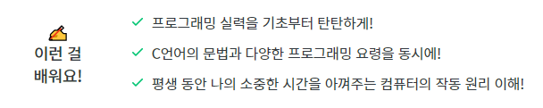

마크다운내용

#

 

---

모든 내용의 출처는 전지전능하신 현 페이스북 스페셜리스트 홍정모 선생님이시다.

[홍정모의 따라하며 배우는 C언어 - 유튜브](https://www.youtube.com/playlist?list=PLNfg4W25Tapyl6ahul_8VS_8Tx3_egcTI){:target="_blank"}
[홍정모의 따라하며 배우는 C언어 - 인프런](https://www.inflearn.com/course/following-c/){:target="_blank"}

{: .notice--primary}

---

**참고 자료**
