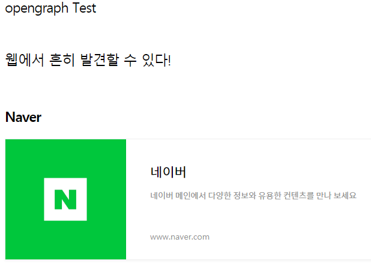

# 1. OpenGraph ?

&nbsp; opengraph 는 facebook 에서 만든 일종의 컨텐츠 미리보기가 첨가된 형태의 하이퍼 링크이다.<BR><BR>
 <BR>
URL을 첨가하면 박스안에 해당 URL의 컨텐츠가 보이는 형태로 링크가 제공된다. <BR>

## 작동 방식
`<head>` 태그내의 메타데이터를 읽고(크롤링)
```
<meta property="og:image" content="이미지">
<meta property="og:title" content="제목">
<meta property="og:description" content="설명">
```
<BR>
그 정보(위의 예시)를 바탕으로 제목, 이미지 그리고 설명이 출력된다.<BR>
거대 SNS 기업인 페이스북에서 사용한 이후로 사실상 웹 페이지 내 메타데이터 표준이 되었다고 한다.

<br><BR>

# 2. 사용법

<BR>

페이스북의 사용 가이드
 - [https://developers.facebook.com/docs/sharing/webmasters?locale=ko_KR#markup](https://developers.facebook.com/docs/sharing/webmasters?locale=ko_KR#markup){:target="_blank"}

<BR>

OpenGraph protocol
 - [https://ogp.me/](https://ogp.me/){:target="_blank"}

<BR>

정리가 잘 된 기사
- [https://www.freecodecamp.org/news/what-is-open-graph-and-how-can-i-use-it-for-my-website/#what-is-open-graph](https://www.freecodecamp.org/news/what-is-open-graph-and-how-can-i-use-it-for-my-website/#what-is-open-graph){:target="_blank"}
 <BR>

## OpenGraph debugger

원하는 url의 og가 어떻게 표현될지 해당 사이트에서 확인 가능하다.
- [https://developers.facebook.com/tools/debug/](https://developers.facebook.com/tools/debug/){:target="_blank"}

<BR><BR>

내 블로그도 og를 사용할 수 있게 커스텀을 해야겠다. 위의 링크를 보니 뭔 내용이 있는지도 모르겠고 참 답답하다.

---

**😎😎**
{: .notice--primary}

---

**참고 자료**

https://blog.ab180.co/posts/open-graph-as-a-website-preview

