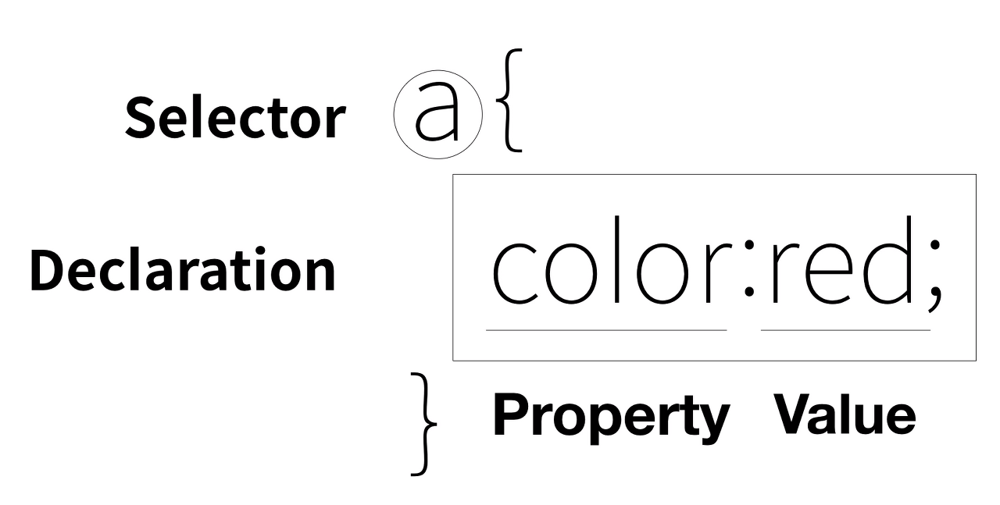

<br>

_7월 21일 수업 요약_

<br>

# 1. CSS (Cascading Style Sheet)

- 웹 페이지에서 CSS를 넣는 방법은 `<style>` 태그를 쓰는 방법과 `style` 속성을 쓰는 방법이 있다. (후자는 inline style로 유지보수의 이유로 비권장한다.)
- 스타일 태그 안 CSS 문법은 아래와 같다.
<center>
 
</center>

<BR><BR>

## Selector ( 선택자 )

- selector (선택자) 는 CSS의 효과를 적용해 줄 대상을 가리켜 선택하는 것이다.
- 선택자로 지정할 수 있는 것은 다음과 같다.
  - tag

  - all elements ( `*` 로 표기한다.)

  - id 와 class

  - parent, child, descendant
    - parent > child(parent) > child 구조   
      
      ```css
      ul > li > a {
        color : #fff;
      }
      ```

    - parent > descendant 구조

      ```css
      ul a {
        color : #fff;
      }
      ```

<BR><BR>

## 외부의 style sheet file

- `link` 를 활용하면 외부의 스타일 시트 파일을 해당 문서에서 이용할 수 있다.

    ```css
    <link rel="stylesheet" type="text/css" href="./css/style.css">
    ```
    
<br><BR>

## 스타일 선언 및 우선순위

- 1순위 :  태그에 style 속성에 선언
- 2순위 : `<style>` 태그에 선언 또는<BR> &nbsp;&nbsp;&nbsp;&nbsp;&nbsp;&nbsp;&nbsp;&nbsp;&nbsp;&nbsp;&nbsp; 링크 태그로 css 파일 참조
- 더 하위의 요소에 스타일을 적용하면, 순서에 상관없이 하위에 적용된다.

>삽입 위치와 선택자에 따라서 `가장 나중에` 넣은 것이 적용된다.

<BR><BR>

### 색상

- RGB (true color)
  - 빨강 초록 파랑의 비율로 색상을 표현하는 방법이다.<BR>`rgb(255, 255, 255)`
  - 각 색상별로 1byte의 메모리 범위를 갖고있다. (unsigned char와 같음)
  - 16진수로 RRGGBB 형식으로 표현하기도 한다. (각 색상별로 00(0)~ ff(255) )<BR> `#ffffff`

- RGBA
  - RGB에 투명도 값인 Alpha를 추가한 것이다.<BR>투명도 Alpha는 배경색에 영향을 받는다.<BR>`rgba(red, green, blue, alpha)`
  
  


<BR><BR>

오늘은 CSS 문법을 배워서 배운 한도내에서 HTML 문서를 꾸며보았다.

#### 학습外

29일에 대면수업을 가서 조별 상담을 받기로 했다.

---

😎😎
{: .notice--primary}

---

**참고 자료**

