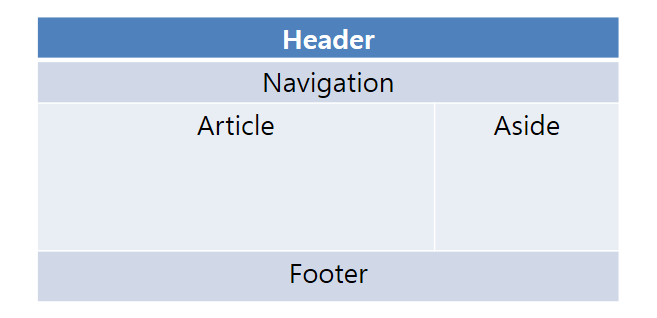

<br>

_7월 26일 수업 요약_

<br>

# 1. position property (위치 속성 )

<BR>

`static`(default)
- 요소를 일반적인 문서 흐름에 따라 배치한다.
- top, right, bottom, left, z-index 속성에 영향을 받지못한다.
<BR>

`relative` - 상대 위치 지정 요소
- 요소를 일반적인 문서 흐름에 따라 배치하고, 자기 자신을 기준으로 위치를 조정한다.
<BR>

`absolute` - 절대 위치 지정 요소
- 요소를 일반적인 문서 흐름에서 제거하고, 문서(static) 또는 조상(relative) 기준 절대 위치 좌표를 설정한다.
<BR>

`fixed` - 절대 위치 지정 요소
- 요소를 일반적인 문서 흐름에서 제거하고, 페이지 레이아웃에 공간도 배정하지 않는다.<BR><a href="/../css/lengths/#viewport-percentage-lengths-뷰포트-백분율-길이-단위">뷰포트</a>의 초기 컨테이닝 블록을 기준으로 삼아 배치한다. (화면 기준 절대 위치 좌표)
- 요소의 조상 중 하나가 transform, perspective, filter 속성 중 어느 하나라도 none이 아니라면 뷰포트 대신 그 조상을 컨테이닝 블록으로 삼는다.
<BR>

`sticky` - 끈끈한 위치 지정 요소(스크롤)
- 요소를 일반적인 문서 흐름에 따라 배치하고, 테이블 관련 요소를 포함해 가장 가까운, 스크롤 되는 조상과, 표 관련 요소를 포함한 컨테이닝 블록(가장 가까운 블록 레벨 조상)을 기준으로 위치를 조정한다.
- 간단히 말해 스크롤 박스 내부에서의 위치 조정이다.
  - `top`, `right`, `bottom`, `left` 로 위치를 조정한다.
- 평소에는 상대 위치 지정 요소로 처리한다.

<BR><BR>

## 1-1. z-index

`z-index` 속성은 요소의 z축 값을 조정할 수 있다.<BR>

> value

`auto`와 `(정수 값)`을 value로 사용한다.<BR>관례적으로 가장 위에 있어야하는 경우에는 9999를 입력한다.

<BR>

## 1-2. overflow

`overflow` 속성은 내부의 요소가 부모의 범위를 벗어날 때 어떻게 처리할지를 지정한다.

> value

`visible` 
- default 값으로 넘친 콘텐츠를 그대로 노출하는 것이다.

`hidden`
- 콘텐츠를 안쪽 여백 상자에 맞추기 위해 잘라낸다.<BR>쉽게 말해 영역을 벗어나는 부분을 안 보이게 한다.

`scroll`
- 넘치는 콘텐츠가 영역을 벗어나는 부분을 스크롤바로 노출한다.\
  > `scroll-margin-top`
    - a 태그로 스크롤을 이동했을 때 상단 마진을 주기 위해 활용한 property 이다.<BR>주의점 : ID가 걸려있는 태그에 걸어야 적용이 된다.

`auto`
- 콘텐츠가 안쪽 여백 상자에 들어간다면 `visible`과 동일하게 보이나, 넘치면 pc 브라우저의 경우 스크롤이 제공된다.

<BR><BR>

# 2. float property

<BR>
(float 속성을 사용한 레이아웃 구성)

선택한 요소가 normal flow 으로부터 빠져 텍스트 및 인라인 요소가 그 주위를 감싸는 자기 컨테이너의 좌우측을 따라 배치된다.<BR>이미지를 글씨 위에 표현하기 위해 만들어진 속성이다.<BR> (말그대로 둥둥 떠다니는듯...)

> left : 왼쪽에 붙임<BR>right : 오른쪽에 붙임

## 2-1. clear

`clear` 속성은 요소가 float 다음일 수 있는지 또는 그 아래로 내려가야 하는지를 지정한다.<BR>float 속성을 부여한 이미지 다음에 위치한 컨텐트의 위치를 지정!

<BR><BR>

# 3. display property (가시 속성)

<BR>

`display` 속성은 요소를 블록과 인라인 요소 중 어느 쪽으로 처리할지와 함께, 플로우, 그리드, 플렉스처럼 자식 요소를 배치할 때 사용할 레이아웃을 설정한다고 한다.<BR>[모질라 display](https://developer.mozilla.org/en-US/docs/Web/CSS/display){:target="_blank"}

> value

`none`
- 태그를 화면에서 보이지 않게 만든다.
  - 관련 설명을 하며 `onclick` 속성을 배웠지만 이는 보안상 문제가 있어 권장되는 속성이 아니라고 한다. (표준도 아니고 안쓸거면 왜 배웠지...)

`block`
- block 요소로 태그를 설정한다. (위에서 아래로 쌓는 방식)

`inline`
- inline 요소로 태그를 설정한다. (왼쪽에서 오른쪽으로 쌓는 방식)

`inline-block`
- inline 표시방식이지만 block처럼 크기 지정이 가능해진다.

<br><BR>

### calc()

- 크기 지정 value 다.
- 연산자는 띄어쓰기를 해줘야 한다.

```css
/* 너비 값을 100%에 200px과 1rem 만큼 빼는 예시 */

article {
  width: calc(100% - 200px - 1rem);
}
```

<BR><BR>

#### 학습外

코딩 테스트를 준비하라!

---

😎😎 &nbsp;
{: .notice--primary}

---

**참고 자료**

[모질라 CSS position property](https://developer.mozilla.org/en-US/docs/Web/CSS/position){:target="_blank"} <BR>
[모질라 CSS z-index](https://developer.mozilla.org/en-US/docs/Web/CSS/z-index){:target="_blank"} <BR>
[모질라 CSS overflow](https://developer.mozilla.org/en-US/docs/Web/CSS/overflow){:target="_blank"} <BR>
[모질라 CSS clear](https://developer.mozilla.org/en-US/docs/Web/CSS/clear){:target="_blank"} <BR>
[모질라 CSS display](https://developer.mozilla.org/en-US/docs/Web/CSS/display){:target="_blank"} <BR>
[모질라 CSS float](https://developer.mozilla.org/en-US/docs/Web/CSS/float){:target="_blank"} <BR>
[clear 자료가 정리된 티스토리 블로그](https://aboooks.tistory.com/79){:target="_blank"} https://aboooks.tistory.com/79