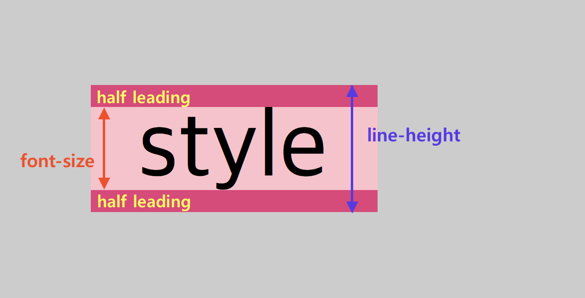

<br>

_7월 27일 수업 요약 첫번째_

<br>

# 1. 글자 속성

<BR>

`font-size`
- 폰트의 <a href="/../css/lengths/" target="_blank">크기</a>를 지정한다. <BR>폰트 크기를 바꾸면 `em`과 `ex` 길이 단위로 계산된 다른 항목들의 크기를 바꾼다.<BR>length는 항상 양수여야 한다.
> value
  - `xx-small`, `x-small`, `small`, `medium`, `large`, `x-large`, `xx-large`<BR>기본 폰트(medium) 크기에 따라 정해진다.

<BR>

`font-family`
- 글꼴 유형(generic-family)이나 사용자 지정 글꼴(font-family)을 설정할 수 있다.
- 글꼴 유형(generic-family)은 다음과 같다.<BR>`serif`, `sans-serif`, `monospace`, `cursive`, `fantasy`
- 띄어쓰기가 들어가는 폰트명은 쌍따옴표(`""`)를 붙여줘야한다.
- link 태그를 활용해 폰트의 데이터를 불러와 쓰거나, OS 기본 내장 글꼴을 쓴다.<BR>내장 글꼴의 경우 해당 글꼴의 이름만 적어도 적용이 가능하다. 사용자마다 OS가 다를 수 있으므로 유의한다.
- 콤마 뒤의 폰트는 앞의 것이 미지원일 경우 대안으로 적용되는 것이다.
  ```css
  h1 {
    font-family: "원하는 폰트", serif
  }
  ```
  이 경우 "원하는 폰트" 가 없을 시 serif 가 적용된다.<BR>이 방법을 활용해 앞에 영어 미지원 한글 폰트를 두고 뒤에 영어 폰트를 두어서 한/영 폰트를 각각 설정할 수 있다.

<BR>

`text-align`
- 글자의 정렬을 설정한다.
>value
  - `left`(왼쪽 정렬)<BR>`center`(중앙 정렬)<BR>`right`(오른쪽 정렬)

<BR>

`text-decoration`
- 글자의 꾸밈요소를 설정한다.
>value
  - `none`, `underline`

<BR>

`font-style`
- 글꼴의 스타일을 설정한다.
>value
  - `normal` (default) : 폰트 기본값 출력
  - `italic` : 이텔릭채 출력
  - `oblique` : 기울어짐꼴 출력

<BR>

`font-weight`
- 글꼴의 가중치(weight)나 굵기(boldness )를 설정한다.
>value
  - `normal`: 보통 폰트 가중치, `400`과 같다.
  - `bold`: 굵은 폰트 가중치, `700`과 같다.
  - `lighter`
    - (가능한 폰트 가중치 중)부모 요소보다 얇은 폰트 가중치를 설정한다.
  - `bolder`
    - (가능한 폰트 가중치 중)부모 요소보다 굵은 폰트 가중치를 설정한다.
  - `100`,`200`, ... , `800`, `900`
    - `normal`과 `bold` 이외의 값, 폰트에서 지원해줘야 한다.

<BR>

`line-height`

<BR>
이미지 출처 : [line-height 개인정리 벨로그](https://velog.io/@ursr0706/line-height-%EC%86%8D%EC%84%B1#:~:text=line%2Dheight%EB%8A%94%20line%2Dbox,%EB%A5%BC%20%EC%84%A4%EC%A0%95%ED%95%98%EB%8A%94%EB%8D%B0%20%EC%82%AC%EC%9A%A9%EB%90%9C%EB%8B%A4.){:target="_blank"}

- 글자의 높이(위 이미지 line-height)를 설정한다.
- 글자를 수직 중앙 정렬할때 활용한다.

<BR>

> font shorthand
- font: `[style]` `[weight]` `[size]` / `[line-height]` `[font-family]`

<BR><BR>

# 2. 배경 속성

`background-image`
- url (내부url 또는 외부url)을 넣어 배경의 이미지를 삽입한다.
```css
body {
background-image: url('../../image/penguin.jpg');
}
```

<BR>

`background-size`
- 값을 하나만 넣으면 너비, 두가지 넣으면 너비와 높이

<BR>

`background-repeat`
- 배경 이미지 반복 방법을 지정한다. 가로축 및 세로축을 따라 반복할 수 있고, 아예 반복하지 않을수도 있다.
>value
  - no-repeat : 반복처리 하지 않음
  - 더 다양한 value 확인 [mozilla background-repeat](https://developer.mozilla.org/ko/docs/Web/CSS/background-repeat){:target="_blank"}

<BR>

`background-attachment`
- 배경 이미지를 뷰포트 내에서 고정할지, 아니면 자신의 컨테이닝 블록과 함께 스크롤할지 지정한다.
>value
  - `fixed`: 배경을 뷰표트에 대해 고정한다.
  - `scroll`: 배경을 요소 자체에 대해 고정한다.
  - `local`: 배경을 요소 콘텐츠에 대해 고정한다.

<BR>

`background-position` [모질라 연습 사이트](https://developer.mozilla.org/en-US/docs/Web/CSS/background-position){:target="_blank"}
- 각 배경 이미지의 초기 위치를 설정한다. 위치는 [background-origin](https://developer.mozilla.org/ko/docs/Web/CSS/background-origin){:target="_blank"}의 레이어에 상대적이다.
- `background-position-x` 로 x 값을 설정하고,<BR>`background-position-y`로 y 값을 설정할 수 있다.
>value
  - `top`, `bottom`, `left`, `right`, `center`

<BR>

> background shorthand
- background: `[image]` `[position]` `[size]` `[repeat]` `[attachement]` `[color]`

<BR><BR>

# 3. 그림자 속성

`text-shadow`
- 글자에 그림자를 부여한다.
> value
  - text-shadow: `오른쪽`, `아래`, `흐림도`, `색상`
    ```css
    text-shadow: 5px 5px 5px black;
    ```

<BR>

`box-shadow`
- 박스에 그림자를 부여한다.
> value
  - box-shadow: `오른쪽`, `아래`, `흐림도`, `색상`
    ```css
    box-shadow: 5px 5px 5px black;
    ```

<BR><BR>

# 4. flex

내용이 많아 [다음 글](../8-2일차/){:target="_blank"}로 이어 씀

<BR><BR>

#### 학습外

<BR>

수요일
- 오후에 강의없음 (간단히 평가내용 안내)<BR>

목요일 (29일)
- 오전에 강의없음 (평가준비 -> 지금하고있는거 완성)<BR>
- 오후에 평가진행 (4시간 -> 컨셉 기획서, html/css 디자인가이드)
- 개인 면담있음

금요일
- git 간단한 사용법, javascript

---

😎😎 &nbsp;
{: .notice--primary}

---

**참고 자료**

https://developer.mozilla.org/en-US/docs/Web/CSS/font-size<BR>
https://developer.mozilla.org/en-US/docs/Web/CSS/font-family<BR>
https://developer.mozilla.org/ko/docs/Web/CSS/font-weight<BR>
[line-height 개인정리 벨로그](https://velog.io/@ursr0706/line-height-%EC%86%8D%EC%84%B1#:~:text=line%2Dheight%EB%8A%94%20line%2Dbox,%EB%A5%BC%20%EC%84%A4%EC%A0%95%ED%95%98%EB%8A%94%EB%8D%B0%20%EC%82%AC%EC%9A%A9%EB%90%9C%EB%8B%A4.){:target="_blank"}<BR>
https://developer.mozilla.org/ko/docs/Web/CSS/background-repeat<BR>
[mozilla background-attachment](https://developer.mozilla.org/ko/docs/Web/CSS/background-attachment){:target="_blank"}