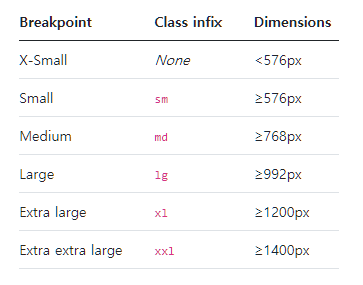

<br>

_7월 28일 수업 요약 1_

<br>

# 1. Media Query

- CSS Media Query는 지정한 규칙에 브라우저 및 장치 환경이 일치하는 경우에만 스타일을 적용시키는 방법을 제공한다.

> 사용방법

  ```css
  /* <style> 태그 안에 미디어 쿼리가 위치할 경우 */
    @media only|not 매체유형 and (표현식) { CSS스타일코드; }

  /* CSS 외부 파일에 미디어 쿼리를 따로 저장할 경우 */
    <link rel="stylesheet" media="매체유형 and|only|not (표현식)" href="CSS파일URL"/>
  
  /* 메타 태그로 뷰포트를 지정 : 너비값 조건을 규칙으로 이용할 경우*/
  <meta name="viewport" content="width=device-width,initial-scale=1">
  ```

## 1-1. 매체 유형
  - `all` : 모든 매체에 사용
  - `print` : 프린터 기기에 사용
  - `screen` : 스크린이 있는 매체에 사용
  - `speech` : 웹 페이지를 읽어주는 스크린 리더에 사용

## 1-2. 표현식 (미디어 쿼리 속성)
  - `width` : 화면의 너비
  - `height` : 화면의 높이
  - `device-width` : 매체 화면의 너비
  - `device-height` : 매체 화면의 높이
  - `device-aspect-ratio` : 매체 화면의 비율
  - `orientation` : 매체 화면의 방향
  - `color` : 매체의 색상 비트 수
  - `color-index` : 매체에서 표현 가능한 색상의 개수
  - `monochrome` : 흑백 매체에서의 픽셀당 비트 수
  - `resolution` : 매체의 해상도
※ color 를 제외한 모든 속성의 앞에는 `min` 또는 `max` 접두사를 사용할 수 있다.

> 활용 예시
<p class="codepen" data-height="240" data-theme-id="dark" data-default-tab="html,result" data-slug-hash="rNmdgmr" data-user="daengdo" style="height: 240px; box-sizing: border-box; display: flex; align-items: center; justify-content: center; border: 2px solid; margin: 1em 0; padding: 1em;">
  <span>See the Pen <a href="https://codepen.io/daengdo/pen/rNmdgmr">
  </a> by DaengDo (<a href="https://codepen.io/daengdo">@daengdo</a>)
  on <a href="https://codepen.io">CodePen</a>.</span>
</p>
<script async src="https://cpwebassets.codepen.io/assets/embed/ei.js"></script>
(결과창의 1배, 0.5배, 0.25배 화면 크기 조절을 눌러보자)

>반응형 웹 페이지 제작의 목적이 있는 기술이므로 viewport 개념을 적극 이용한다. <BR> <a href="{{ home }}/css/lengths/#viewport-percentage-lengths-뷰포트-백분율-길이-단위">`viewport <length>` 정리링크(클릭)</a>

<BR>

## 1-3. breakpoints

breakpoints 는 CSS Media Query를 적용할 화면 크기 기준이다.<BR>UI 프레임워크 종류별로 권장되는 breakpoints가 다르다.

<BR>
(예시 : 부트스트랩의 권장 breakpoints)

---

😎😎 &nbsp;
{: .notice--primary}

---

**참고 자료**

