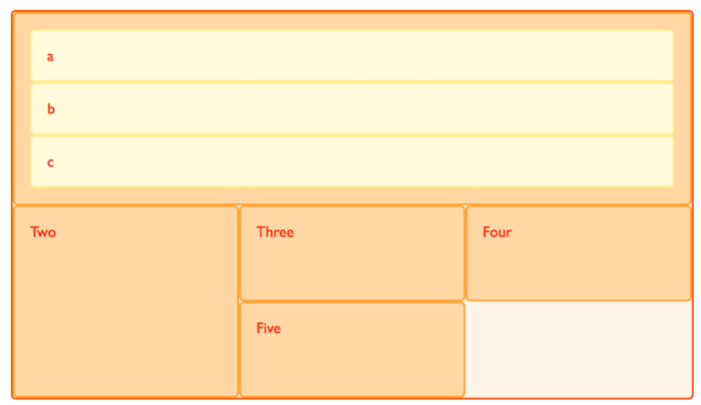
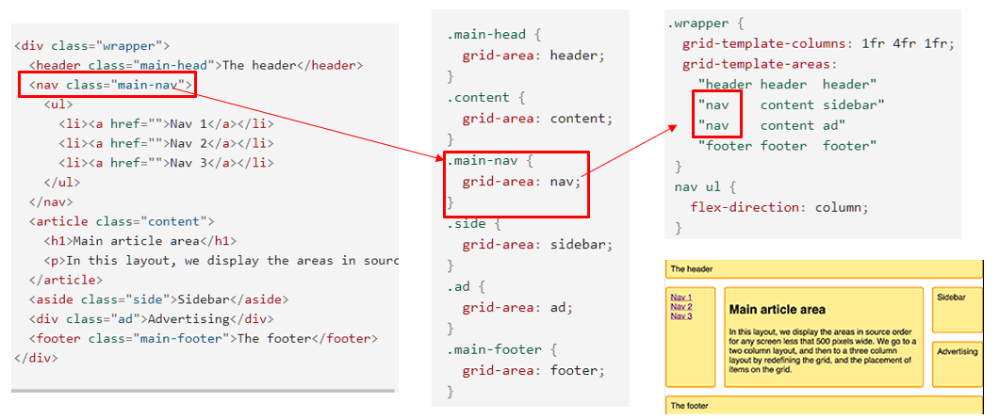

<br>

_7월 28일 수업 요약 2_

<br>

# 1. Grid ??

CSS 그리드 레이아웃(Grid Layout)은 CSS에 2차원(행, 열)의 그리드 시스템을 도입했다. 그리드는 주요 페이지 영역을 설계하거나 작은 사용자 인터페이스 요소를 배치하는 용도로 유용하다.

<BR>

> 사용법
  - `display: grid;` 로 하위 태그들을 그리드 항목으로 다룰 것임을 설정한다.
  - `grid-area` 속성으로 그리드의 항목을 이름지어 준다.
  - `grid-template-columns` 속성으로 그리드의 비율을 설정한다.
  - `grid-template-areas` 속성으로 원하는 배열을 설정한다.

```css
/* 1. grid를 사용할 것임을 설정 */
div {
  display: grid;
}

/* 2. grid-area로 항목 명명 */
div {
  grid-area: content1;
}

/* 3. grid-template-columns로 비율 설정 */
/* 4. grid-template-areas로 배열 설정 */
body {
  grid-template-columns: 1fr 2fr 3fr;
  grid-template-areas:
    "content1  content2  content3"
    "content4  content5  content6"
}
```
<p class="codepen" data-height="310" data-theme-id="dark" data-default-tab="html,result" data-slug-hash="QWvmXoR" data-user="daengdo" style="height: 310px; box-sizing: border-box; display: flex; align-items: center; justify-content: center; border: 2px solid; margin: 1em 0; padding: 1em;">
  <span>See the Pen <a href="https://codepen.io/daengdo/pen/QWvmXoR">
  </a> by DaengDo (<a href="https://codepen.io/daengdo">@daengdo</a>)
  on <a href="https://codepen.io">CodePen</a>.</span>
</p>
<script async src="https://cpwebassets.codepen.io/assets/embed/ei.js"></script>

(예시로 짠 그리드 레이아웃)

<BR>

# 2. Grid Fragment

fragment(조각)는 공간을 차지하는 비율을 나타낸다.

<p class="codepen" data-height="220" data-theme-id="dark" data-default-tab="html,result" data-slug-hash="yLbKdor" data-user="daengdo" style="height: 220px; box-sizing: border-box; display: flex; align-items: center; justify-content: center; border: 2px solid; margin: 1em 0; padding: 1em;">
  <span>See the Pen <a href="https://codepen.io/daengdo/pen/yLbKdor">
  </a> by DaengDo (<a href="https://codepen.io/daengdo">@daengdo</a>)
  on <a href="https://codepen.io">CodePen</a>.</span>
</p>
<script async src="https://cpwebassets.codepen.io/assets/embed/ei.js"></script>

(2 : 1 : 1 의 비율을 나타낸 예시이다)

<BR>

# 3. Grid template areas

<BR>

(grid template areas 사용법 예시)

---

😎😎 &nbsp;
{: .notice--primary}

---

**참고 자료**

