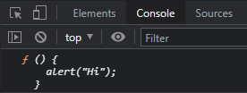

<br>

_8월 5일 수업 요약_

<br>

오전에는 JS 에서 반복문 예제를 풀어봄(별찍기 같은거)

.repeat 문 배워봄 개념 한번 찾아보자


# 1. 함수 표현식 (Function Expression)

- JS에서의 함수는 특별한 종류의 값으로 취급한다.
- 함수를 변수에 할당할 수 있다.
  ```js
  let sayHi = function() {
    alert("Hello");
  };
  // 함수를 만들고 그 함수를 변수 sayHi에 할당한 모습
  ```

- 함수는 값이기 때문에 함수 코드를 출력할 수도 있다.<BR>
  ```js
  let sayHi = function() {
    alert("Hello");
  };

  console.log(sayHi); // 콘솔창에 함수의 코드가 보인다.
  ```
  
  - sayHi 옆에 괄호가 없기 때문에 함수가 실행되지 않는다.<BR>위 코드는 함수 소스 코드가 문자형으로 바뀌어 출력되었다.

- 함수를 복사해 다른 변수에 할당할 수도 있다.
  ```js
  function sayHi() {    // 1. 함수 선언
    alert("Hello");
  }

  let func = sayHi;     // 2. 함수 복사

  func();               // 3. 복사한 함수를 실행
  sayHi();              //    본래 함수도 정상적으로 실행됨
  ```
  1. 함수 선언으로 함수 생성, 생성한 함수는 `sayHi`라는 변수에 저장된다.
  2. `sayHi`를 새로운 변수 `func`에 복사한다.<BR>이때 `sayHi`에 괄호가 없다.<BR>괄호가 있었다면 `func = sayHi()` 가 되어 함수의 호출 결과(return 값)가 `func` 에 저장된다.
  3. `sayHi()`와 `func()` 로 함수를 호출할 수 있게 되었다.

<BR><BR>

## 1-1. 콜백 함수

- Call Back, 나중에 호출되는 함수를 말한다.<BR>(이벤트가 발생했거나 특정 시점에 도달했을 때 시스템에서 호출하는 함수)
- 일반적인 함수와 문법적 특징이 다른것이 아니라 호출 방식에 의한 구분이다.<BR>(아래는 매개변수 3개가 있는 콜백함수 예시)

```js
function ask(question, yes, no) {
  if (confirm(question)) yes()
  else no();
}

function showOk() {
  alert("동의했습니다");
}

function showCancel() {
  alert("취소했습니다");
}

// 함수 showOk와 showCancel 이 ask 함수의 인수로 전달됨
ask("동의하십니까?", showOk, showCancel);
```
- 함수 `ask`의 인수 `showOk`와 `showCancel`이 '콜백함수'이다.
- 함수를 함수의 parameter로 전달하고, 필요하다면 전달한 그 함수를 '니중에 호출(call back)'하는 것이 콜백 함수의 개념이다.<BR>위 예시에서는 'yes' 인 경우 `showOk`가 콜백이 되고, 'no'인 경우 `showCancel`이 콜백이 된다.

<BR>

똑같은 함수를 더 짧게 표현할 수 있다.
아래 예시는 익명 함수를 콜백으로 전달하는 경우이다.
```js
/* 아래는 익명함수 예시 */
function ask(question, yes, no) {
  if (confirm(question)) yes()
  else no();
}

ask(
  "동의하십니까?",
  function() { alert("동의했습니다"); },
  function() { alert("취소 버튼을 눌렀습니다"); },
);
```
- `ask(...)` 안의 이름 없이 선언한 함수를 '익명 함수(anonymous function) 라고 부른다.
- 익명 함수는 변수에 할당된 게 아니기 때문에 `ask` 바깥에서 접근할 수 없다.
- 익명 함수는 코드를 분리해서 처리하는 목적으로 사용된다. (재사용성 고려 안함)

<BR><BR>

## 1-2. 함수 표현식 vs 함수 선언문 (차이점)

- 함수 선언문은 주요 코드 흐름 중간에 독자적인 구문 형태로 존재하고,<BR>함수 표현식은 표현식이나 구문 구성 내부에 생성된다.

  ```js
  // 함수 선언문
  function sum(a, b) {
    return a + b;
  }

  // 함수 표현식
  let sum = function(a, b) {
    return a + b;
  };
  ```

<BR>

- 함수 선언문은 함수 선언문이 정의되기 전에도 호출할 수 있다.<BR>함수 표현식은 실제 실행 흐름이 해당 함수에 도달했을 때 함수를 생성한다. 따라서 실행 흐름이 함수에 도달했을 때 부터 해당 함수를 사용할 수 있다.<BR>(JS에서는 스크립트가 실행되기 전 '초기화 단계' 에서 함수 선언 방식으로 정의한 함수가 먼저 생성되기 때문이다)

  ```js
  sayHi("John"); // Hello, John

  function sayHi(name) {
    alert( `Hello, ${name}` );
  }
  ```
  - 함수 선언문의 경우 sayHi가 먼저 생성되었기 때문에 어디서든 접근이 가능하다.

  ```js
  sayHi("John"); // error!

  let sayHi = function(name) { // ★여기서 함수 생성
    alert( `Hello, ${name}` );
  };
  ```
  - 함수 표현식은 실행 흐름이 표현식에 다다랐을 때 만들어지기 때문에 ★ 로 표시한 줄에 실행 흐름이 도달했을 때 함수가 만들어진다.

<BR>

- 함수 선언문이 코드 블록 내에 위치하면 해당 함수는 블록 내 어디서든 접근 가능하며, 블록 밖에서는 그 함수에 접근하지 못한다.<BR>함수 표현식은 블록 외부에서도 접근이 가능하다. ↓

  ```js
  /* 함수 선언문 */
  let age = 16; // 16을 저장했다 가정

  if (age < 18) {
    welcome();               // \   (실행)
                            //  |
    function welcome() {     //  |
      alert("안녕!");        //  |  함수 선언문은 함수가 선언된 블록 내
    }                        //  |  어디에서든 유효
                            //  |
    welcome();               // /   (실행)

  } else {

    function welcome() {
      alert("안녕하세요!");
    }
  }

  // 여기는 중괄호 밖이기 때문에
  // 중괄호 안에서 선언한 함수 선언문은 호출할 수 없다.

  welcome(); // Error: welcome is not defined
  ```
  - 반면 함수 표현식에서는 접근이 가능하다. ↓

  ```js
  let age = prompt("나이를 알려주세요.", 18);

  let welcome;

  if (age < 18) {

    welcome = function() {
      alert("안녕!");
    };

  } else {

    welcome = function() {
      alert("안녕하세요!");
    };

  }

  welcome(); // 제대로 동작
  ```
  - 위 코드를 물음표 연산자를 사용해 단순화할 수 있다. ↓

  ```js
  let age = prompt("나이를 알려주세요.", 18);

  let welcome = (age < 18) ?
    function() {alert("안녕!");} :
    function() {alert("안녕하세요!");};
  ```

<BR>

---

😎😎 &nbsp;
{: .notice--primary}

---

**참고 자료**

https://ko.javascript.info/function-expressions