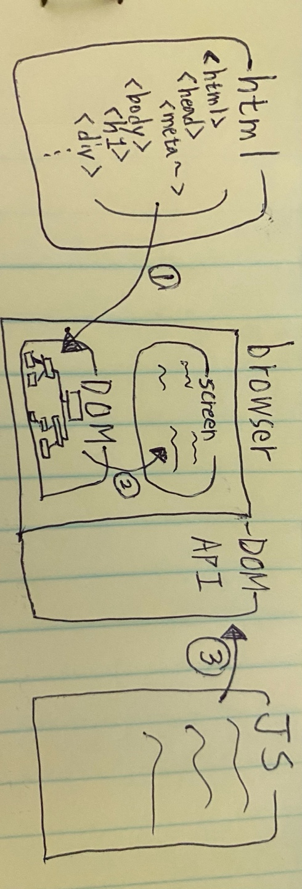

<br>

_8월 12일 수업 요약 1_

<br>

# 1. DOM

문서 객체 모델(Document Object Model,DOM)은 웹 페이지 내의 모든 콘텐츠를 객체로 나타내준다.



(DOM이 뭔지 알아보기 위한 간단한 웹 동작 구조)

① 브라우저에서 HTML문서를 읽어서 객체화(특정 형식으로 데이터를 가공해 메모리 공간에 구조화한 것) 한 후에 DOM 이라는 메모리 공간에 저장한다.<BR>
- HTML 문서는 브라우저 안에서 DOM 트리로 표현된다.
  - 태그는 요소 노드(element node)이고, 트리 구조를 구성한다.<BR>`<html>` 은 루트 노드가 되고 `<head>`와 `<body>`는 루트 노드의 자식이 된다.
  - 요소 내의 문자(띄어쓰기와 줄바꿈 포함)는 `#text`로 표현되는 텍스트 노드가 된다.
  - HTML 안의 모든 것은 (주석포함) DOM을 구성한다.

② DOM에 저장된 객체 구조를 화면에 출력한다.<BR>

③ JS로 DOM [API](../../scrap/API){:target="blank"}에 접근해 DOM(문서를 객체화한 구조)을 제어한다.<BR>

<BR><BR>

# 2. DOM 탐색하기

DOM을 이용하면 요소와 요소의 콘텐츠에 무엇이든 할 수 있다.<BR>
조작하고자 하는 DOM 객체(노드)에 접근하기 위한 키워드들을 배웠다.

- `<html>` = `document.documentElement`
- `<body>` = `document.body`
- `<head>` = `document.head`

<BR>

## 2-1. childNodes, firstChild, lastChild

- 자식 노드(child node, children) : 바로 아래의 자식 요소를 나타낸다.
- 후손 노드(descendants) : 중첩 관계에 있는 모든 요소를 의미한다. (자식 노드, 자식 노드의 모든 자식 노드 등)

- `childNodes` 컬렉션은 텍스트 노드를 포함한 모든 자식 노드를 담고 있다.
  ```html
  <html>
  <body>
    <div>시작</div>

    <ul>
      <li>항목</li>
    </ul>

    <div>끝</div>

    <script>
      for (let i = 0; i < document.body.childNodes.length; i++) {
        alert( document.body.childNodes[i] ); // Text, DIV, Text, UL, ... , SCRIPT
      }
    </script>
    ...추가 내용...
  </body>
  </html>
  ```
(`document.body`의 자식 노드들이 출력된 모습이다)

- `childNodes`는 반복 가능한 유사 배열 객체인 '컬렉션'이다.
  - `for ... of` 를 사용할 수 있다.
    ```js
    for (let node of document.body.childNodes) {
      console.log(node);  // 컬렉션 내의 모든 노드를 보여준다.
    }
    ```
  - 배열이 아니기 때문에 배열 메서드를 쓸 수 없다.<BR>배열 메서드를 사용하려면 `Array.from`을 사용해 배열로 만들어야 한다.
    ```js
    console.log(document.body.childNodes.filter); 
    // undefined (filter 메서드가 없습니다.)

    console.log(Array.from(document.body.childNodes).filter);
    // function
    ```
- `firstChild` 와 `lastChild` 프로퍼티를 이용하면 첫 번째, 마지막 자식 노드에 빠르게 접근할 수 있다.
  ```js
  childNodes[0] === childNodes.firstChild
  childNodes[childNodes.length - 1] === childNodes.lastChild
  ```

<BR>

> 주의사항
- DOM 컬렉션은 읽는 것만 가능하다. `childNodes[i] = ...` 를 이용해 자식 노드를 교체하는 것은 불가능하다.(DOM 변경방법은 아래에)
- 컬렉션에 `for...in`을 사용하는것은 부적절하다.<BR>`for...of`를 사용해 컬렉션을 순회할 수 있으나, `for...in` 반복문은 객체의 모든 열거 가능한 프로퍼티를 순회하기 때문에 불필요한 프로퍼티까지 불러온다.

<BR><BR>

## 2-3. sibling, parent nodes

같은 부모를 가진 노드는 형제(sibling) 노드라고 부른다.

- `nextSibling` 는 다음 형제 노드에 대한 정보를 찾는다.
- `previousSibling` 는 이전 형제 노드에 대한 정보를 찾는다.
- `parentNode` 는 부모 노드에 대한 정보를 찾는다.

```js
// <body>의 부모 노드는 <html>
console.log(document.body.parentNode === document.documentElement); // true

// <head>의 다음 형제 노드는 <body> 
console.log(document.head.nextSibling); // HTMLBodyElement

// <body>의 이전 형제 노드는 <head>
console.log(document.body.previousSibling); // HTMLHeadElement
```

<BR>

## 2-4. 요소 간 이동

위의 탐색 관련 프로퍼티는 모든 종류의 노드를 참조한다. 작업에 불필요한 텍스트 노드나 주석 노드보다는 웹 페이지를 구성하는 태그인 요소 노드를 특정하는 방법이 있다.

`Element` 라는 단어를 추가해주면 된다.

- `children` 프로퍼티는 해당 요소의 자식 노드 중 요소 노드만을 가리킨다.
  ```html
  <html>
  <body>
    <div>시작</div>

    <ul>
      <li>항목</li>
    </ul>

    <div>끝</div>

    <script>
      for (let elem of document.body.children) {
        alert(elem); // DIV, UL, DIV, SCRIPT
      }
    </script>
    ...
  </body>
  </html>
  ```
  (요소 노드만 출력된다.)
- `firstELementChild`와 `lastElemenetChild` 프로퍼티는 각각 첫 번째 자식 요소 노드와 마지막 자식 요소 노드를 가리킨다.
- `previousElementSibling`과 `nextElementSibling`은 형제 요소 노드를 가리킨다.
- `parentElement`는 부모 요소 노드를 가리킨다.


---

😎😎 &nbsp;
{: .notice--primary}

---

**참고 자료**
https://ko.javascript.info/dom-nodes<BR>
https://ko.javascript.info/dom-nodes#ref-984<BR>
https://ko.javascript.info/dom-navigation<BR>
