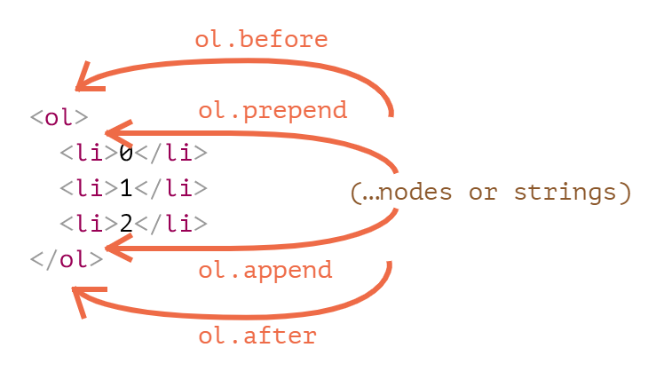
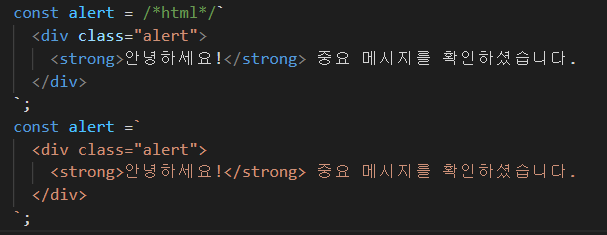

<br>

_8월 13일 수업 요약 2_

<BR>

# 1. 노드로 DOM 문서 수정하기

JS로 DOM에 접근해 노드를 조작해 기존 콘텐츠를 수정할 수 있다.

<BR>

## 1-1. 요소 생성하기

DOM 노드를 만들때 사용하는 메서드는 두 가지가 있다.

- `document.creatElemnet('tag')` : 태그 이름을 사용해 새로운 요소 노드를 만든다.
  ```js
  let div = document.creatElement('div');
  ```
- `document.creatTextNode('text')` : 주어진 텍스트를 사용해 새로운 텍스트 노드를 만든다.
  ```js
  let textNode = document.creatTextNode('안녕하세요.');
  ```

<BR>

## 1-2. 요소의 속성 설정

- `변수명.className = 속성값` 으로 요소의 속성을 설정할 수 있다.
```js
div.className = "alert";
```

<BR>

## 1-3. 요소의 내용 설정

```js
div.innterHTML = "<strong>안녕하세요!</strong>";
```

<BR>

## 1-4. 요소 삽입 메서드

여러 키워드를 사용해서 새롭게 만든 요소 노드를 페이지에 나타낼 수 있다.

- `node.append(노드나 문자열)`
  - `node` 안에 '(노드나 문자열)'을 마지막 자식으로 삽입한다.
- `node.prepend(노드나 문자열)`
  - `node` 안에 '(노드나 문자열)'을 첫 번째 자식으로 삽입한다.
- `node.before(노드나 문자열`
  - `node` 이전에 '(노드나 문자열)'을 형제요소로 삽입한다.
- `node.after(노드나 문자열)`
  - `node` 이후에 '(노드나 문자열)'을 형제요소로 삽입한다.
- `node.replaceWith(노드나 문자열)`
  - `node` 를 '(노드나 문자열)'로 대체한다.



<BR><BR>

# 2. insertAdjacentHTML 메서드

`insertAdjacentHTML`은 문서의 원하는 위치에 소스코드 형태로 문자열을 추가할 수 있는 메서드이다.

- 문법은 `elem.insertAdjacentHTML(where, html)`로 쓴다.

- 첫 번째 매개변수인 `where`은 `elem`을 기준으로 하는 상대 위치이다.
  - `beforebegin` : elem 바로 앞에 html을 삽입한다.
  - `afterbegin` : elem의 첫 번째 자식 요소에 html을 삽입한다.
  - `beforeend` : elem의 마지막 자식 요소에 html을 삽입한다.
  - `afterend` : elem 바로 다음에 html을 삽입한다.

  ```html
  <!--beforebegin: 시작태그 이전에-->
  <div id="elem">
    <!--afterbegin: 시작태그 다음에(첫번째 자식요소)-->
    <div>annother 태그</div>
    <!--beforeend: 끝태그 이전에(마지막 자식요소)-->
  </div>
  <!--afterend: 끝태그 다음에-->
  ```
- 두 번째 매개변수인 `html`은 HTML 문자열로, 소스코드 형태로 그대로 삽입된다.
  - back-quote(`), template-literal(조각UI 표기법)의 형태로 표기해야 한다. 그래야만 엔터(\n)를 인지한다.
  - VScode에서 es6-string-html 플러그인을 설치한다면 `/*html*/` 주석 처리로 html 태그 형태 색 정보를 제공한다.<BR>
  

  ```js
  // 한 줄로 쓰는 방법
  elem.insertAdjacentHTML('beforeend', `<div class="alert">
    <strong>안녕하세요!</strong> 중요 메시지를 확인하셨습니다.
  </div>`);

  ```
  ```js
  // 긴 매개 변수를 따로 처리해서 가독성을 올리는 방법
  const alert123 = `
    <div class="alert">
      <strong>안녕하세요!</strong> 중요 메시지를 확인하셨습니다.
    </div>    
  `;
  ```
  ```js
  elem.insertAdjacentHTML('beforeend', alert123);
  ```

<BR><BR>

# 3. 노드 삭제하기

`node.remove()` 를 사용하면 노드를 삭제할 수 있다.

<BR><BR>

---

😎😎 &nbsp;
{: .notice--primary}

---

**참고 자료**

https://ko.javascript.info/modifying-document