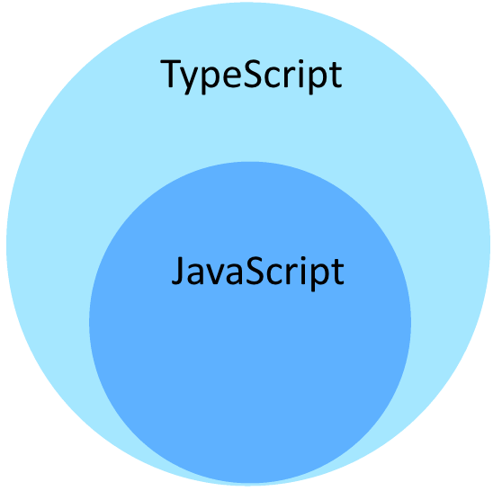

<br>

_8월 18일 수업 요약 1_

<br>

# 1. TypeScript



JavaScript를 기반으로 만들어진 프로그래밍 언어이다.

JS는 타입 시스템이 없는 동적 프로그래밍 언어로, JS의 변수는 여러 타입의 값을 가질 수 있다.
```js
let variable = 1; // Number 

variable = "Hello, JS!";  // String

console.log(variable);  // Hello,JS!
```
위와 같이 형식의 유연성으로 데이터를 다루기는 좋으나, 형식이 없으므로 IDE와 컴파일 환경에서 코드를 입력하는 동안 오류를 확인할 수 없어 런타임 환경에서 쉽게 에러가 발생하는 단점이 있다.<BR>

TypeScript는 이런 JavaScript(기존의 동적 타입)에 강한 타입 시스탬을 적용해 대부분의 에러를 컴파일 환경에서 코드를 입력하는 동안 확인할 수 있는 장점이 있다.<BR>
또한 정적 타입을 사용하기 때문에 에디터의 자동완성 기능 제공이 JS보다 원활하다.

TS의 실행은 JS로 컴파일 된 후에 실행된다. 때문에 JS를 지원하는 모든 플랫폼에서 TS의 사용이 가능하다.

<br>

> TS 쓰는 이유
- 타입 채크로 사전에 오류를 방지한다.
- 편집기에서 JS보다 자동완성의 제공이 좋다.

쓰고보니 프로그래머의 생산성과 관련된 문제인것 같다. 생산성이 향상되니 사용성이 충분히 납득된다.

<BR><BR>

# 2. TS 개발환경 구축

Node.js를 [설치](../23-2/#2-1-nodejs-npm){:target=_blank}하고 npm을 통해 설치하면 된다.

`npm install -g typescript`<BR>
`npm install -g ts-node`<BR>
`npm install -g @types/node`

을 cmd 창에 입력하여 설치를 해주면 된다.

<BR>

앞으로 Typescript를 익히고자 React를 Typescript로 배우기로 했다. 이후의 React 수업은 모조리 Typescript 코드로 작성된다.


---

😎😎 &nbsp;
{: .notice--primary}

---

**참고 자료**

https://www.typescriptlang.org/

https://www.typescriptlang.org/ko/docs/handbook/typescript-from-scratch.html