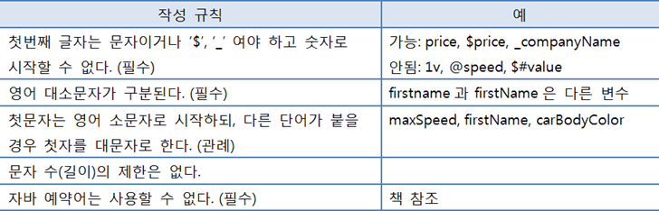
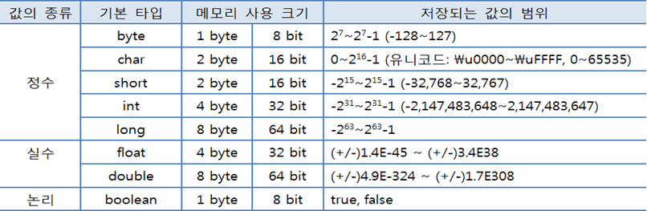

<br>

_9월 6일 수업 요약_

<br>

# spring 설치

spring은 Java/Kotlin 기반의 웹 프레임워크이며, 전자정부표준프레임워크의 기준이 된다. 게다가 spring tools 4는 Java와 eclipse가 내장되어 있어 추가설치 없이 간편하게 사용할 수 있다.

[Spring Tools 4 공식 홈페이지 다운로드](https://spring.io/tools){:target="_blank"} (spring 공식 홈페이지에서 eclipse 용 spring을 받았다.  )

다운로드 파일이 jar 확장자라면 zip 확장자로 이름만 바꿔준 뒤(jar 확장자는 java archive file로 zip파일과 구조가 같음) 압축을 풀어 스프링 파일을 원하는 경로에 저장하면 된다.

<BR>

자바스크립트와 같거나 중요하지 않은 내용은 강조하지 않고 빠르게 지나갔다.

<BR>

# 1. 변수

- 자바의 변수 선언은 타입이 변수명 앞에 붙는다.
  ```java
  // 타입 변수명; 순서
  int age;
  double value;
  ```
- 명명 규칙<BR>
- 변수는 중괄호 블럭 범위 내에서만 이용된다.

<BR>

# 2. 데이터 타입



- 문자열(String)은 primitive type이 아니고 참조 타입이다.

<br>

# 3. 타입 변환

- 자동(묵시적) 타입 변환 (Promotion)
  - 프로그램 실행 도중 작은 타입은 큰 타입으로 자동 타입 변환이 가능하다.
- 강제(명시적) 타입 변환 (Casting)
  - 큰 타입을 작은 타입 단위로 쪼개기 때문에 끝의 한 부분만 작은 타입으로 강제적 변환이 이루어저 truncation 이 발생하는 등 데이터 소실이 생긴다.
- 서로 다른 타입의 피연산자는 두 피연산자 중 크기가 큰 타입으로 자동 변환되어 연산된다.
- [C 언어의 타입변환](../../c/5-11){:target="_blank"}와 비슷하다. 다만 C언어는 데이터의 소실이 이루어저도 컴파일되지만, Java는 에러창을 출력하는것 같다.

<BR>

# 4. 연산자

- 연산 우선순위는 `단항` < `2항`(산술, 비교, 논리) < `3항` < `대입` 연산자 순서이다. (대입이 가장 마지막)
- Java에서 문자열(String)은 참조 객체이기 때문에 연산자 사용시 주의해야 한다.
  - `문자열` + `숫자`는 `문자열`을 출력한다.
  - 문자열의 동치 비교는 `equals()`함수를 이용해야 한다. `==` 를 사용하면 안된다.
    ```java
    String name1 = "DaengDo"; // 문자열은 쌍따옴표만 허용됨
		String name2 = "DaengDo";
		System.out.println(name1 == name2); // true
		System.out.println(name1.equals(name2)); // true

		String name3 = new String("DaengDo");
		String name4 = new String("DaengDo");

		// String 동치비교에서 이 방법을 쓰지 말 것
		System.out.println(name3 == name4); // 참조하는 객체가 다르므로 false

		// String인 경우 동치 비교에 equal 함수를 이용 (항상)
		System.out.println(name3.equals(name4)); // true
    ```
- 비트와 쉬프트 부분을 제외하고 자바스크립트와 내용이 겹쳐 빠르게 지나갔다.

<BR>

# 5. 조건문과 반복문

JavaScript와 동일해 핵심만 훑고 지나갔다.
{: .small}

>조건문
- `if문`: 조건식 결과에 따라 중괄호 { } 블록 실행 여부를 정한다.
- `switch문`: 변수나 연산식의 값에 따라 실행문을 선택할 때 사용한다.

>반복문
- `for문`: 반복 횟수를 알고 있을 때 주로 사용한다.
- `while문`: 조건에 따라 반복을 계속할지 결정할 때 사용한다.

>중지 관련
- `break`: 반복문을 종료하고 switch문 또한 종료 시킨다. 중첩 반복문의 경우 가장 가까운 반복문만 종료된다. `Label`(이름)을 붙여 반복문 종료 시점을 정할 수 있다.
- `continue`: 반복문에서 사용하며 for문의 경우 증감식으로 이동하고 while문의 경우 조건식으로 이동한다.

<BR>

# 6. 배열

- 배열타입[] 배열변수명 = {..초기화 목록} 로 배열을 선언 및 초기화한다.
  ```java
  int[] scores = { 83, 90, 87 }
  ```
  - `new` 키워드를 이용하여 생성할수도 있다.
    ```java
    int[] arrInt = new int[3]; // 크기가 3인 int 배열 생성
    ```
- 기본형 데이터 타입(primitive type)은 null 처리가 불가능하다.
  ```java
  // int[0] = null; // 에러가 뜬다.
  int[0] = 0;
  ```
- 참조형 배열은 null 초기화가 가능하다. (문자열은 참조형 타입)
  ```java
  String[] arrStr = new String[3]; // 크기가 3인 String 배열 생성
  System.out.println(arrStr[0]); // null 초기화 되어있음
  System.out.println(arrStr[2]); // null 초기화 되어있음
  System.out.println(arrStr[3]); // null 초기화 되어있음
  ``` 
- Java 에서 배열은 크기가 고정되어 있어 배열 요소의 추가, 삭제가 불가능하다.
  - 기존 항목의 값을 변경하거나 0/false 또는 null 초기화만 가능

<BR>

# 7. enhanced(advanced) for loop

- 향상된 for 문
- `for(요소변수타입 요소변수 : 배열변수명){}` 으로 사용한다.
  ```java
  String[] languages = { "Java", "Typescript", "ECMAscript", "HTML", "CSS" };
	for (String lang : languages) {
		System.out.println(lang);
	}
  // Java
  // Typescript
  // ECMAscript
  // HTML
  // CSS
  ```

# tip) Scanner
java의 프롬프트 창에서 입력을 받을 수 있는 기능이다.
- `scanner.next()` 로 문자열 값을 입력받을 수 있고, <BR>`scanner.nextInt()`로 숫자 값을 입력받을 수 있다.
  ```java
  package exercise;

  import java.util.Scanner;

  public class ScannerExample {
    public static void main(string[] args) {
      Scanner scanner = new Scanner(System.in);
      System.out.println("--문자열을 입력--");
      System.out.println(">");
      String input = "";
      input = scanner.next();   // 문자열 값을 입력받는다.
      System.out.println(input);

      System.out.println("--숫자를 입력--");
      System.out.println(">");
      int num = 0;
      num = scanner.nextInt();  // 숫자 값을 입력받는다.
      System.out.println(num);
    }
  }
  ```

<BR>

---

😎😎 &nbsp;
{: .notice--primary}

---

**참고 자료**

이것이 자바다