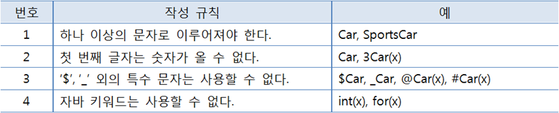

<br>

_9월 7일 수업 요약 1_

<br>

# 객체 지향 프로그래밍(OOP)

`Object-Oriented Programming`

부품 객체를 먼저 만들고 이것들을 하나씩 조립해 완성된 프로그램을 만드는 기법이다.<BR>여러 프로그래머가 함께 협업해 소프트웨어를 제작할 때 부품 단위로 나눠 만드는 방법론을 제시한다.

<BR>

# 객체(Object)
- 캡슐화: 속성(필드)과 동작(메소드)으로 구성된다.
- 정보 은닉: 객체에 포함된 정보의 손상과 오용을 막는다.
- 객체들은 서로 간에 기능(동작)을 이용하고 데이터를 주고 받는다.
  - 객체 간의 관계는 집합, 사용, 상속 관계가 있다.
- 다형성: 실행 결과가 다양한 객체를 대입할 수 있다. 객체를 부품화시키고 유지보수가 용이하다는 장점이있다.

<BR>

# 필드(field)
- 객체의 고유 데이터, 객체가 가져야 할 부품 객체, 객체의 현재 상태 데이터를 갖고있다.
- 필드선언은 `타입 필드 [= 초기값]` 형태로 작성한다.
  ```java
  String name;
  String country = korea;
  int age;
  boolean isAdmin;
  ```
- 객체 내부에서는 `필드이름` 으로 접근하고,<BR>객체 외부에서는 `변수.필드이름`으로 접근한다.
  ```java
  // 객체 내부
  void getAdmin() {
    isAdmin = true;
  }
  // 객체 외부
  Member m1 = new Member();
  m1.name = DaengDo;
  ```

<BR>

# 메소드(method)

- 객체의 동작(기능)을 정의한 코드이다.
- 메소드를 호출하면 중괄호 블록에 있는 코드들이 실행된다.
- `리턴타입 메소드이름 (매개변수) {실행할코드}` 형태로 작성한다.
  - 리턴값은 있을 수도 있고 없을 수도 있다.
    ```java
    // 리턴이 있는 경우
    String getId() {
      return this.id;
    }
    // 리턴 값이 없는 경우
    void printMemberInfo() {
      System.out.println(this.name + " " + this.age);
    }
    ```
  - 메소드 이름은 camelCase로 작성한다.
- 클래스 내부에서는 메소드 이름으로 호출하고,<BR>클래스 외부에서는 객체 생성 후, 참조 변수를 이용해 호출한다.

## 메소드 오버로딩(overloading)

- 객체의 메서드(생성자)가 다양한 형태를 가지는 것을 `overloading` 이라고 한다. (객체의 다형성)
- 클래스 내에 같은 이름의 메소드를 여러 개 선언할 수 있다.
- 하나의 메소드 이름으로 다양한 매개변수를 받기 위해서 작성한다.
- 매개변수의 타입, 개수, 순서에 차이가 있어야 오버로딩이 성립된다.


<BR>

# this

- 인스턴스(객체) 자신의 참조를 가지고 있는 키워드이다.
  - Java에서의 `this`는 해당 참조를 가르키기 때문에 JS와 같은 context 문제가 일어나지 않는다.
- 객체 내부에서 인스턴스 멤버임을 명확히 하기 위해 `this.`을 사용한다.
  - 인스턴스 멤버: 인스턴스가 갖고 있는 필드와 메소드, 각각 인스턴스 필드와 인스턴스 메소드라고 부른다.
  - 인스턴스 멤버는 객체에 종속되어 있기 때문에 객체가 없이는 사용 불가능하다.
- 매개변수와 필드명이 동일할 때 인스턴스 필드임을 명확히 하기 위해 사용한다.
  ```java
  Member(String name) {
    this.name = name;
  }
  ```

<BR>

# 클래스
- 객체를 생성하기 위한 필드와 메소드를 정의한다.
  - field(attribute, property)는 객체의 속성을 정의한다.
  - Method는 객체의 기능에 해당하는 함수이다.
- 클래스 명명 규칙
  - 
  - 첫 글자는 대문자로 적는다.
- 소스파일당 하나의 클래스를 선언한다. (두 개 이상도 가능하나 그렇게 쓴다면 OOP 언어인 Java를 쓰는 의미가 없다)
- 하나의 클래스당 하나의 바이트 코드 파일이 생성된다.

## 인스턴스 생성

- `new` 연산자는 객체를 생성하는 역할을 한다. 객체를 생성 후, 객체 생성 메모리 번지를 반환한다.
- `생성자(constructor)`는 클래스로부터 객체를 생성할 때 호출되어 객체의 초기화를 담당한다. 생성자를 만들지 않았어도 인스턴스를 생성할 때 자동으로 기본 생성자가 호출된다.
  - 클래스로부터 만들어진 객체를 해당 클래스의 `인스턴스(instance)`라고 부른다.<BR>(자바에서는 인스턴스와 객체가 같다고 생각하면 편하다.)
  - 생성자가 만들어저있다면 기본 생성자는 생성되지 않는다.
- 클래스는 `field`, `constructor`, `method` 로 구성된다. (필수아님)

> 예시

아래는 Member 클래스로 MemberList 클래스에 인스턴스를 생성하는 예시이다.
{: .small}

```java
public class Member {

// 필드
  String id;
  String password;
  int age; 
  boolean isAdmin;

// 기본 생성자의 형태
  // public Member(){
  // }

// 생성자를 만들게되면 기본 생성자를 만들어주지 않는다.
  public Member(String id, String password){
    this.id;
    this.password;
  }

// 생성자를 여러개 만들 수 있다. (오버로딩)
  public Member(String id, String password, int age, boolean isAdmin){
    this.id;
    this.password;
    this.age;
    this.isAdmin;
  }
}
```

(위는 멤버 인스턴스를 생성하는 클래스 아래는 멤버 리스트 클래스)
{: .small}

```java
public class MemberList {
  public static void main(String[] args) {
    // 클래스명 인스턴스변수명 = new 클래스명()
    // Member m1 = new Member();
    // 기본 생성자가 없기 때문에 만들 수 없다. (에러)

    // id가 DaengDo, password가 abc123 인 인스턴스
    Member m2 = new Member(DaengDo, abc123);

    // 또다른 회원정보 인스턴스 생성
    Member m3 = new Member(DoDaeng, qwer, 28, false);
  }
}
```
- 생성자 메서드를 실행해 인스턴스(객체)를 만드는 방법의 예시이다. (생성자로 필드를 초기화하여 인스턴스를 만들었다)

<BR>

# static

- 정적 멤버는 클래스에 고정된 멤버로서 객체를 생성하지 않고 사용할 수 있는 필드와 메소드를 말한다.
  - 객체마다 갖고 있어야 할 데이터라면 인스턴스 필드로 선언하고,<BR>객체마다 갖고 있을 필요가 없는 공용 데이터라면 정적 필드로 선언한다.
    ```java
    // static 타입 필드 [=초기값];
    static double pi = 3.141592;
    ```
    ex) 파이 값은 객체마다 갖고있을 필요가 없는 변하지 않는 공용 데이터이므로 정적 필드로 선언하는것이 좋다.
    {: .small}
  - 인스턴스 필드를 포함하고 있다면 인스턴스 메소드로 선언하고,<BR>인스턴스 필드를 포함하지 않는다면 정적 메소드로 선언한다.
    ```java
    // static 리턴타입 메소드(매개변수선언) {실행할 코드}
    static int plus(int x, int y) { return x + y; }
    ```
    ex) 덧셈 기능은 외부에서 주어진 매개값들을 가지고 수행하므로 정적 메소드로 선언하는것이 좋다.
    {: .small}
- 자주 쓰는 값이나 기능을 static으로 정의하여 사용한다.
  - 필드와 메소드를 기능적인 관점에서 실행시킨다. (그렇기 때문에 주로 final 변수를 넣어 상수로 활용한다.)
- 클래스가 메모리로 로딩되면 정적 멤버를 사용할 수 있다. (일반필드, 메서드는 객체를 생성할 때 메모리 공간 초기화가 일어남)<BR>클래스 이름과 함께 도트`.` 연산자로 접근한다.<BR>`클래스.필드;`<BR>`클래스.메소드(매개값 ...);`
- static 변수는 객체 공간이 아닌 클래스(메서드) 공간에 생성되므로 `this`(생성된 객체를 가르킴)를 사용할 수 없다.


<BR>


---

😎😎 &nbsp;
{: .notice--primary}

---

**참고 자료**
