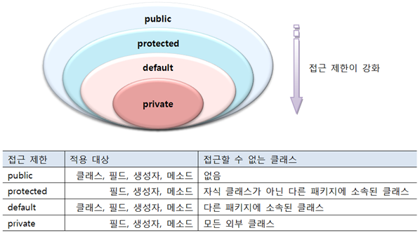
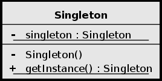
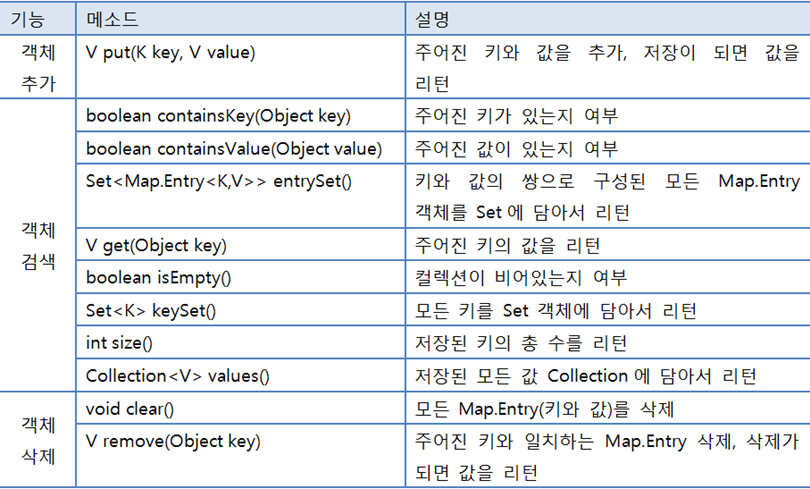

 

_9월 8일 수업 요약_

 

# 패키지

- 클래스를 기능별로 묶어서 그룹 이름을 붙여놓은 것이다.
  - 파일들을 관리하기 위해 사용하는 폴더(디렉토리)와 유사한 개념
  - 패키지의 물리적인 형태는 파일 시스템의 폴더다.
- 패키지는 클래스 이름의 일부이다.
  - 클래스를 유일하게 만들어주는 식별자 역할을 한다.
  - 전체 클래스의 이름은 `상위패키지.하위패키지.클래스` 이다. 따라서 클래스명이 같아도 패키지명이 다르다면 다른 클래스로 취급한다.
- `import` 문으로 같은 페키지에 있는 클래스끼리 클래스 이름으로 사용 가능하다. 패키지가 다른 클래스를 사용할 경우 패키지 명이 포함된 클래스의 전체 이름으로 사용할 수 있다.

 

# 접근 제한자

- 클래스 및 클래스의 구성 멤버에 대한 접근을 제한하는 역할을 한다.
  - 다른 패키지에서 클래스를 사용하지 못하도록(클래스 제한)
  - 클래스로부터 객체를 생성하지 못하도록(생성자 제한)
  - 특정 필드와 메소드를 숨김 처리 (필드와 메소드 제한)
- 

 

# getter, setter

- 클래스를 선언할 때 필드는 기본값으로 default 접근 제한자를 갖는다.

> getter
- 메소드로 필드 값을 가공해서 외부로 전달하는 역할을 한다.(주로 private 필드의 값을 리턴하는 역할)
  - `public 필드타입 get필드명()` 또는 `public 필드타입 is필드명()` 메소드의 형태로 쓴다.

> setter
- 메소드로 매개값을 검증해서 유효한 값만 객체의 필드에 저장하는 역할을 한다.
  - `public void set필드명(필드타입 변수명)` 메소드의 형태로 쓴다.

 

# singleton

- 클래스에서 하나의 객체만 만들도록 보장해야 하는 경우 사용하는 디자인 패턴이다.  UML 다이어그램 : 
  - 메소드를 기능적인 관점에서 실행하는 클래스를 필요로 할때 사용한다.

 

- 수업중 배운 싱글턴을 생성하는 방법은 아래와 같다. (다양한 구현 방법이 있지만 아래의 한 가지만을 배웠다.)
1. 기본 생성자를 외부에서 접근못하게 한다.
2. private static 필드로 객체를 생성한다. (static이 선언되어있기 때문에 프로그램이 실행될 때 변수 초기화가 일어난다.)
3. 외부에서 private static 으로 생성한 객체를 접근할 수 있게 한다.(객체 접근 메소드를 이용해서 사전에 생성된 객체만 접근해서 사용하게 한다.)

SE(소프트웨어 공학)적 관점에서 특정한 상황에서 해결책을 제시할 수 있는 경우 이를 패턴이라고 부른다.

 

# Map

- `<key, value>` 로 구성된 형태의 자료구조이다.
- key는 중복이 될 수 없으나 value는 중복이 될 수 있다.
- HashMap 만드는 법 : `Map<키타입, 값타입> 맵변수 = new HashMap<키타입, 값타입>();`
- 맵 컬렉션의 주요 메소드  
- HashMap 공부해서 내용 추가

---

😎😎 &nbsp;
{: .notice--primary}

---

**참고 자료**

[wikipedia 싱글턴](https://ko.wikipedia.org/wiki/%EC%8B%B1%EA%B8%80%ED%84%B4_%ED%8C%A8%ED%84%B4){:target="_blank"}