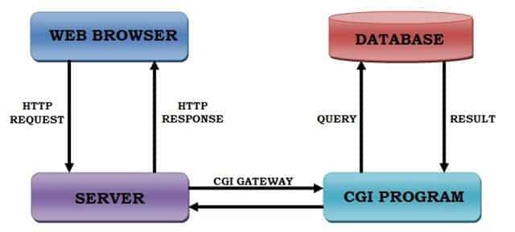
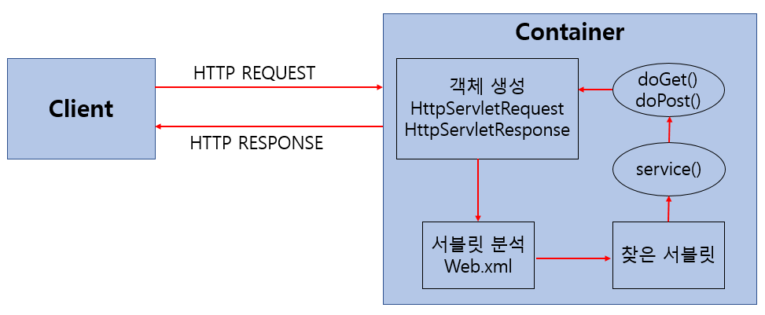
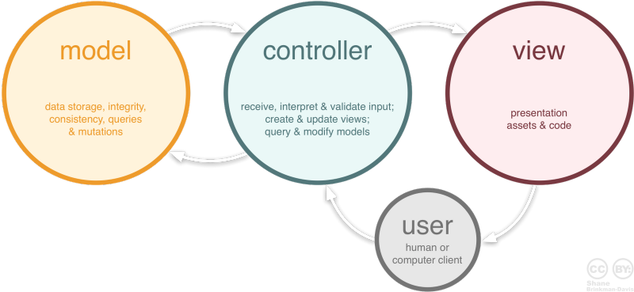

 

_9월 14일 수업 요약_

TDD 개념 제시하고 테스트 케이스 직접 작성해보았음 (아직 정리못함)

 

## web 용어

- `CGI (Common Gateway Interface)`
  - 서버와 애플리케이션 간에 데이터를 주고 받는 방식 또는 관례
  - 

- `Servlet`
  - 클라이언트의 요청을 처리하고, 그 결과를 반환하는 Servlet 클래스의 구현 규칙을 지킨 자바 웹 프로그래밍 기술
  - 

- `MVC`
  - 프로젝트를 Model, View, Controller 역할로 구분한 디자인 패턴이다.
  - 

- `Web Server`
  - 정적컨텐츠(html, css, js, img, video, 서버에서 처리하지않는 컨텐츠)를 요청받으면 응답만 해주는 서버. (일반적으로 웹 서버는 HTTP 요청과 파일을 주고받는 역할)

- `WAS` (Web Application Server)
  - 복잡한 연산을 처리하며 데이터베이스나 외부 서비스와 상호작용하면서 비즈니스 로직을 처리한다.(웹 페이지를 매개로 하여 사용할 수 있는 응용 프로그램)
  - 정적 컨텐츠만 다루는 웹 서버와 다르게 동적 컨텐츠(서버에서 가공한 데이터)도 다룬다.

## Java 코드 이해안되던거

- `ConcurrentSkipListMap`
  - 자바 컬렉션 프레임워크 맵 종류 중 하나
  - 동시성 처리를 위한 자료구조, 먼저 들어온 작업이 먼저 실행되고 나중에 들어온 작업이 먼저 실행되는것을 방지함.
    - 다른 스레드가 작업중인 `key`로 접근 못하도록 잠금을 함

- `AtomicLong`
  - Long 자료형을 갖고 있는 Wrapping 클래스(객체로 포장해 주는 클래스)
  - `AtomicLong()` : 초기값이 0인 AtomicLong을 생성
  - `AtomicLong(longVal)` : 인자의 값으로 초기화된 AtomicLong을 생성

 

- `thread`
  - 프로세스보다 작은 실행 흐름의 최소 단위
  - 하나의 프로세스에서 여러개의 스레드가 메모리를 공유하여 작동 가능 (다중 처리 능력)

TDD (Test Driven Development)
  - 테스트 케이스 구축
  - unit test
  - integration test
  - statement coverage
  - branch coverage

 

---

😎😎 &nbsp;
{: .notice--primary}

---

**참고 자료**
