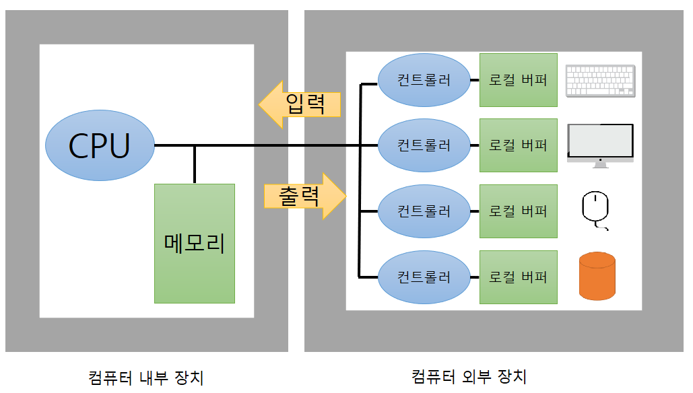

# 1. 컴퓨터 시스템의 구조

- `내부장치` : CPU, 메모리
- `외부장치 (입출력장치)` : 디스크, 키보드, 마우스, 모니터, 네트워크 장치 등
- 메모리 및 입출력장치 등의 각 하드웨어 장치에는 <a href="../2장/#5-3-주변장치-및-입출력-장치" target="_blank">컨트롤러</a>가 있다.

>입출력 (Input-Output, I/O)

- `Input` : 컴퓨터 외부장치로 데이터가 나가는 것
- `Output`: 컴퓨터 내부로 데이터가 들어오는 것

 

# 2. CPU 연산과 I/O 연산

 

- `CPU 연산` : 컴퓨터 내에서 수행되는 연산으로 CPU가 담당한다.
- `I/O 연산` : 입출력 장치들의 컨트롤러가 담당한다.
  > CPU 연산과 I/O 연산은 동시 수행이 가능하다.

🙂 example)

A라는 프로그램은 CPU를 할당받아 프로그램 코드를 수행 중 
B라는 프로그램은 하드디스크에서 정보를 읽어오는 작업을 수행 중

→ 두 가지 일이 다른 곳에서 발생하므로 동시에 수행되는 것이 가능!

## 2-1. 로컬 버퍼

- 외부 장치에서 I/O 연산 데이터를 임시로 저장하기 위한 작은 메모리이다.

## 2-2. 인터럽트 라인

- CPU는 한번에 한 명령만 수행하며 각 명령 하나를 수행할 때마다 인터럽트가 발생했는지 확인한다.  인터럽트가 발생했으면 다음 명령을 수행하기전에 인터럽트를 처리하고 그렇지 않으면 다음 명령을 수행한다. 

- (하드웨어)인터럽트는 키보드 입력 혹은 요청된 디스크 입출력 작업의 완료 등 CPU에 알려줄 필요가 있는 이벤트가 일어난 경우 컨트롤러가 발생시키는 것이다.

  

담에 또 정리해야지 일단 졸려서 자야겠당!

# 3. 인터럽트의 일반적 기능

# 4. 인터럽트 핸들링

# 5. 입출력 구조

# 6. DMA

 

---

**😎😎**
{: .notice--primary}

---

**참고 자료**

<a href="http://www.kyobobook.co.kr/product/detailViewKor.laf?ejkGb=KOR&mallGb=KOR&barcode=9791158903589" target="_blank">운영체제와 정보기술의 원리</a>